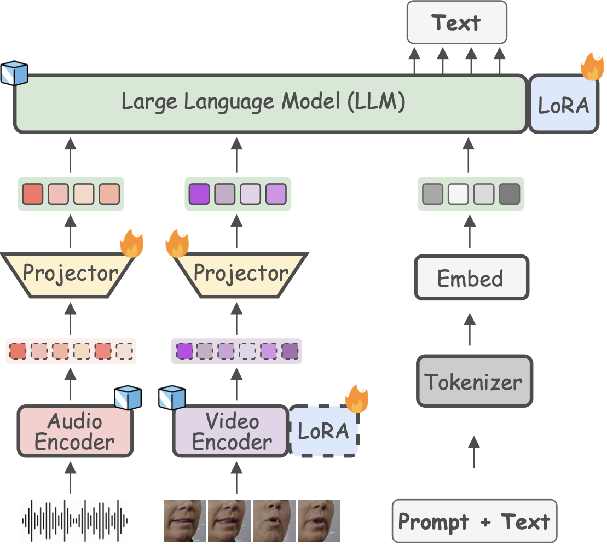

# Llama-AVSR: an MLLM Designed for Audio-Visual Speech Recognition

This is the official repository for the paper "[**Large Language Models are Strong Audio-Visual Speech
Recognition Learners**](https://arxiv.org/pdf/2409.12319)", ***U. Cappellazzo***, *M. Kim*, *H. Chen*, *P. Ma*, *S. Petridis*, *D. Falavigna*, *A. Brutti*, *M. Pantic*.

## 📣 News 📣
- ```[2025.03]``` We release **code** and **ckpts** of Llama-AVSR, and the camera-ready version of the [**paper**](https://arxiv.org/abs/2409.12319) 🔥🔥.
- ```[2024.12]``` Our paper has been accepted for publication at **ICASSP** 2025 🚀🚀.
- ```[2024.09]``` We release the [**arXiv paper**](https://arxiv.org/abs/2409.12319) 🦙.


## Llama-AVSR Overwiew 🔍

**Llama-ASVR** is a Multimodal LLM (MLLM) trained to perform the tasks of ASR, VSR, and AVSR. As such, it comprises three main components: **1)** pre-trained audio and video encoders, **2)** audio/video MLP projection layers, and **3)** a Llama-based LLM, which is parameter-efficiently finetuned via LoRA. **Llama-AVSR** is trained on three different amounts of data (30h, 433h, 1756h) and tasks, achieving sota results when tested on the LRS3 dataset. Due to its modularity, **Llama-AVSR** facilitates the seamless integration of various pre-trained encoders and LLMs of different sizes, letting the user choose the desired configuration based on specific requirements.

<p align="center">
     <br>
</p>

## Setup 🛠 
### 1) Installation

Install necessary dependencies: 

```bash
   pip install -r requirements.txt
   cd av_hubert
   git submodule init
   git submodule update
   cd fairseq
   pip install --editable ./
```

<details>
  <summary><strong>Issues with opencv-python package?</strong></summary>
If you encounter issues with opencv-python (e.g., ImportError: libGL.so.1: cannot open shared object file: No such file or directory), pip uninstall opencv-python and pip install opencv-python-headless. This trick solves the issue.

</details>

### 2) Datasets Pre-processing

We rigorously follow auto-avsr [paper](https://arxiv.org/abs/2303.14307) to pre-process the LRS3 and VoxCeleb 2 datasets. All the steps 
to achieve this can be found [here](https://github.com/mpc001/auto_avsr/tree/main/preparation).

For LRS3, the tree-structure of the directory is:

```
LRS3  
└───labels
|     lrs3_train_transcript_lengths_seg16s.csv 
|     lrs3_test_transcript_lengths_seg16s.csv 
|       
└───lrs3
    └─── lrs3_text_seg16s
    |     └─── ...
    └─── lrs3_video_seg16s
          └─── ...
```

### 3) Label Files Download

The label files in `[LRS3]/[labels]` undergo some processing to make them fit Llama-AVSR. For example, we lowercase the transcription and discard samples whose length is higher than a specific threshold to avoid training instability and peak GPU memory usage. Based on the desired training setting, the processed labels can be accessed below. Once downloaded, they must be moved to `[LRS3]/[labels]` subfolder. 

| Label Files | Dataset(s) | Hours |
|-----|:-----:|:-----:|
|['lrs3_30h_train_transcript_lengths_seg16s_LLM_lowercase_12.csv'](https://drive.google.com/file/d/11t5BDnl05p3A5kR1rIaSosW2vXK915BN/view?usp=drive_link)|"Low-Resource" LRS3 ("trainval")|30|
|['lrs3_train_transcript_lengths_seg16s_LLM_lowercase_25.csv'](https://drive.google.com/file/d/1ytq7-fuC6R7G3r2MQPAWYXkJac9Ja3UB/view?usp=drive_link)|LRS3|433|
|['lrs3vox2en_train_transcript_lengths_seg16s_LLM_lowercase_25.csv'](https://drive.google.com/file/d/123Y7uUfppghmmJUhwum7fKGHYjbHJXsC/view?usp=drive_link)|LRS3 + VoxCeleb2|1756|
| ['lrs3_test_transcript_lengths_seg24s_LLM_lowercase.csv'](https://drive.google.com/file/d/17ob4j1AQZo7NOqr1hP6_z5fZ1ldmGVWA/view?usp=sharing)|LRS3 test file|/|

## Training Stage 🏋️

### Preliminaries 
Before starting the training process, make sure you **1)** have a wandb account to track your experiments and **2)** have access to the pre-trained LLMs like Llama 3.1-8B (i.e., you need to request access from HF [here](https://huggingface.co/meta-llama/Llama-3.1-8B)). You also have to download the AV-HuBERT Large model pretrained on LRS3 + VoxCeleb2, accessible [here](https://dl.fbaipublicfiles.com/avhubert/model/lrs3_vox/clean-pretrain/large_vox_iter5.pt).

To set up the desired experiment to run, we have several main arguments to define, listed below (all arguments can be inspected in the `train.py` script):
<details open>
  <summary><strong>Main Arguments</strong></summary>
    
- `exp-dir`: Directory to save checkpoints and logs to.
- `root-dir`: Root directory of preprocessed dataset.
- `project-wandb`: Name of the wandb project to track the results.
- `exp-name`: Experiment name. Location of checkpoints is `[exp_dir]`/`[exp_name]`.
- `modality`: The modality we use to train Llama-AVSR. Choices: [`audio`, `video`, `audiovisual`].
- `llm-model`: The Llama-based LLM to use. Choices: [`TinyLlama/TinyLlama_v1.1`, `meta-llama/Llama-2-13b-hf`, `meta-llama/Llama-2-7b-hf`, `meta-llama/Meta-Llama-3.1-8B`].
- `num-nodes`: Number of machines used. Default: `1`.
- `gpus`: Number of GPUs per machine. Default: `1`.

</details>

There are **additional arguments** to define, which are mainly modality-specific. More details below.

<details>
  <summary><strong>Additional Arguments</strong></summary>
    
- `prompt-audio`: This is the prompt used for the ASR task. By default, this is set to `Transcribe speech to text.`. Likewise, we define the prompt for the VSR task (`prompt-video`) and AVSR task (`prompt-audiovisual`).
- `pretrain-avhubert-enc-video-path`: This is the path to the pre-trained AV-HuBERT video encoder.
- `audio-encoder-name`: The pre-trained audio encoder. Choices: [`openai/whisper-medium.en`, `microsoft/wavlm-large`, `av-hubert`].
- `unfrozen_modules`: The modules to unfroze before starting the training. This can be the LoRA modules of the LLM (`peft_llm`) or the LoRA modules of the video encoder (`lora_avhubert`). 
- `add_PETF_LLM`: Whether to fine-tune the LLM via LoRA. Set to `lora` if we use LoRA, else `None`.
- `reduction_lora` and `alpha`: if we fine-tune the LLM via LoRA, we need to define the factor by which we reduce the hidden size (`reduction_lora`) and the scaling factor (`alpha`). 
- `max-epochs`: Number of epochs to train Llama-AVSR.
- `num-average-epochs`: We average the last `num-average-epochs` ckpts. Default: `4`.
- `downsample-ratio-audio`: This argument defines the compression rate to apply to the audio tokens before the LLM. Likewise, we define the compression rate for the video tokens (`downsample-ratio-video`).
- `max-frames-audio`: Max number of audio frames in a batch. This number can be adjusted based on the own GPU memory. For video and audio-visual we define a similar value.  
- `lr`: The learning rate of the AdamW optimizer. For ASR and AVSR, we set it to `1e-3`, for VSR to `5e-4`.
- `weight-decay`: The weight decay of the optimizer. Default: `0.1`.

</details>

### ASR Task 🗣️

**Example 1.**

The command below trains Llama-AVSR using `Whisper Medium` as audio encoder, the LLM is `Llama 3.1-8B` (finetuned using LoRA). We reduce the audio tokens by a factor `3`. We use `8` GPUs from a single node. 

```Shell
python train.py --exp-dir path_to_exp_dir --root-dir path_to_root_dir --project-wandb wandb_project_name \
--exp-name ASR_ex1 --modality audio --llm-model meta-llama/Meta-Llama-3.1-8B --audio-encoder-name openai/whisper-medium.en \
--add_PETF_LLM lora --unfrozen_modules peft_llm --reduction_lora 64 --alpha 8 --downsample-ratio-audio 3 --num-nodes 1 --gpus 8 \
--max-frames-audio 1000 --lr 1e-3 
```

**Example 2.**

The code to train Llama-AVSR with the same setup as above but with `AV-HuBERT Large` as audio encoder (i.e., 8th row of Table 1 in our paper) is slightly different. The command to run is as follows:

```Shell
python train.py --exp-dir path_to_exp_dir --root-dir path_to_root_dir --project-wandb wandb_project_name \
--exp-name ASR_exp2 --modality audio --llm-model meta-llama/Meta-Llama-3.1-8B --pretrain-avhubert-enc-audio-path path_to_avhubert_ckpt \
--audio-encoder-name av-hubert --add_PETF_LLM lora --unfrozen_modules peft_llm --reduction_lora 64 --alpha 8 \
--downsample-ratio-audio 3 --num-nodes 1 --gpus 8 --max-frames-audio 1000 --lr 1e-3
```

### VSR Task 👀

For `VSR`, we use `AV-HuBERT Large` (+ LoRA), the LLM is `Llama-2-7B` (+ LoRA). We apply a compression rate of `3`. 

```Shell
python train.py --exp-dir path_to_exp_dir --root-dir path_to_root_dir --project-wandb wandb_project_name \
--exp-name VSR_exp --modality audio --llm-model meta-llama/Llama-2-7b-hf --pretrain-avhubert-enc-video-path path_to_avhubert_ckpt \
--use-lora-avhubert True --add_PETF_LLM lora --unfrozen_modules peft_llm lora_avhubert --reduction_lora 64 \
--alpha 8 --downsample-ratio-video 3 --num-nodes 1 --gpus 8 --max-frames-video 1000 --lr 5e-4 
```

### AVSR Task 🗣👀

**Example 1.**

For `AVSR`, we use `AV-HuBERT Large` as video encoder and `Whisper Medium` as audio encoder, the LLM is `Llama 3.1-8B` (finetuned using LoRA). We reduce both the audio and video tokens by a factor `3`.

```Shell
python train.py --exp-dir path_to_exp_dir --root-dir path_to_root_dir --project-wandb wandb_project_name \
--exp-name AVSR_exp1 --modality audiovisual --audio-encoder-name openai/whisper-medium.en \
--pretrain-avhubert-enc-video-path path_to_avhubert_ckpt --llm-model meta-llama/Meta-Llama-3.1-8B --unfrozen_modules peft_llm \
--add_PETF_LLM lora --reduction_lora 64 --alpha 8 --downsample-ratio-audio 3 --downsample-ratio-video 3 \
--num-nodes 1 --gpus 8 --max-frames-audiovisual 1000 --lr 1e-3
```

**Example 2.**

To reproduce the results obtained using AV-HuBERT to process both audio and video tokens (third to last row in Table 1 in our paper), run this command:

```Shell
python train.py --exp-dir path_to_exp_dir --root-dir path_to_root_dir --project-wandb wandb_project_name \
--exp-name AVSR_exp2 --modality audiovisual_avhubert --single-projector-avhubert False --audio-encoder-name openai/whisper-medium.en \
--pretrain-avhubert-enc-audiovisual-path path_to_avhubert_ckpt --llm-model meta-llama/Meta-Llama-3.1-8B --unfrozen_modules peft_llm \
--add_PETF_LLM lora --reduction_lora 64 --alpha 8 --downsample-ratio-audiovisual 2 \
--num-nodes 1 --gpus 8 --max-frames-audiovisual 1000 --lr 1e-3
```

<details>
  <summary><strong>Want to perform training and inference at the same time?</strong></summary>
Set --auto-test True when starting a training experiment and define the inference arguments as explained in the next section.

</details>

## Inference ☄️

To test a trained model, either you set `--auto-test True` when starting a new training experiment, so the inference is performed automatically at the end of the traning, or you can run `eval.py`. In both cases, a handful of inference arguments must be specified as follows:

<details open>
  <summary><strong>Inference Arguments</strong></summary>
    
- `max-dec-tokens`: Maximum number of tokens that can be generated by the LLM. Default: `32`.
- `num-beams`: Number of beams for beam search decoding. Default: `15`.
- `decode-snr-target`: Level of signal-to-noise ratio (SNR). Default: `999999` (i.e., clean setting).

</details>

If you want to run an inference experiment, you need to define the argument `--pretrained-model-path` and set it to the path to the pre-trained ckpt. Furthermore, you need to specify the same arguments used for the training. Below two examples that test the pre-trained ckpts from the model zoo. 

**Example 1.**

We run the inference for the ASR pre-trained ckpt in the model zoo. The command is as follows:

```Shell
python eval.py --exp-name ASR_inference --modality audio --project-wandb wandb_project_name \
--pretrained-model-path path_to_asr_ckpt --root-dir path_to_root_dir --llm-model meta-llama/Meta-Llama-3.1-8B \
--audio-encoder-name openai/whisper-medium.en --unfrozen_modules peft_llm --add_PETF_LLM lora \
--reduction_lora 64 --alpha 8 --downsample-ratio-audio 3 --max-dec-tokens 32 --num-beams 15 --test-file lrs3_test_transcript_lengths_seg24s_LLM_lowercase.csv
```

**Example 2.**

We run the inference for the AVSR pre-trained ckpt in the model zoo. The command is as follows:

```Shell
python eval.py --exp-name AVSR_inference --modality audiovisual --project-wandb wandb_project_name \
--pretrained-model-path path_to_avsr_ckpt --root-dir path_to_root_dir --llm-model meta-llama/Meta-Llama-3.1-8B \
--pretrain-avhubert-enc-video-path path_to_avhubert_ckpt --unfrozen_modules peft_llm \
--add_PETF_LLM lora --reduction_lora 64 --alpha 8 --downsample-ratio-video 2 --downsample-ratio-audio 4 \
--max-dec-tokens 32 --num-beams 15 --test-file lrs3_test_transcript_lengths_seg24s_LLM_lowercase.csv
```

## Model Zoo 🤩

We release the best ckpt for each task. 

| Model Ckpt | Training Hours | WER [%] | Trainable Par. (M) |
|-----|:-----:|:-----:|:-----:|
|['ASR_Whisper-M_Llama3.1-8B_lrs3vox_down3_seed42.pth'](https://drive.google.com/file/d/1LwMKmG4x63M0J8jINRg9DwmEzvADeBWv/view?usp=sharing)|1756|0.728|42|
|['VSR_AVH-L_Llama3.1-8B_lrs3vox_down3_seed42'](https://drive.google.com/file/d/1GhKo47kBez8Uj_SJF91k43SWtf1CG3w8/view?usp=drive_link)|1756|23.68|48|
|['AVSR_Whisper-M_AVH-L_Llama3.1-8B_lrs3vox_Adown4_Vdown2_seed42'](https://drive.google.com/file/d/1h8dTWZdzaEJChv-bWX305NGJe2g8BaaA/view?usp=drive_link)|1756|0.748|57|

**Note**: due to the LLM inference parameters (e.g., `"temperature": 0.6`), the results you obtain can slightly differ from inference to inference. For instance, for the ASR ckpt you can obtain a WER of `0.728` or `0.718`.


## Star History

[](https://www.star-history.com/#umbertocappellazzo/Llama-AVSR&Date)

## Citation 📝

If you find this project useful for your research or applications, please kindly cite our work:

```latex
@inproceedings{cappellazzo2024large,
  title={Large Language Models are Strong Audio-Visual Speech Recognition Learners},
  author={Cappellazzo, Umberto and Kim, Minsu and Chen, Honglie and Ma, Pingchuan and Petridis, Stavros and Falavigna, Daniele and Brutti, Alessio and Pantic, Maja},
  booktitle={ICASSP 2025-2025 IEEE International Conference on Acoustics, Speech and Signal Processing (ICASSP)},
  pages={1--5},
  year={2025},
  organization={IEEE}
}

```

## Acknowledgement 🤝🏻

This repository relies on the [**avhubert**](https://github.com/facebookresearch/av_hubert) and [**auto-avsr**](https://github.com/mpc001/auto_avsr) repositories.

## Contact ✉️

You can reach out to me here: `umbertocappellazzo@gmail.com`. 
